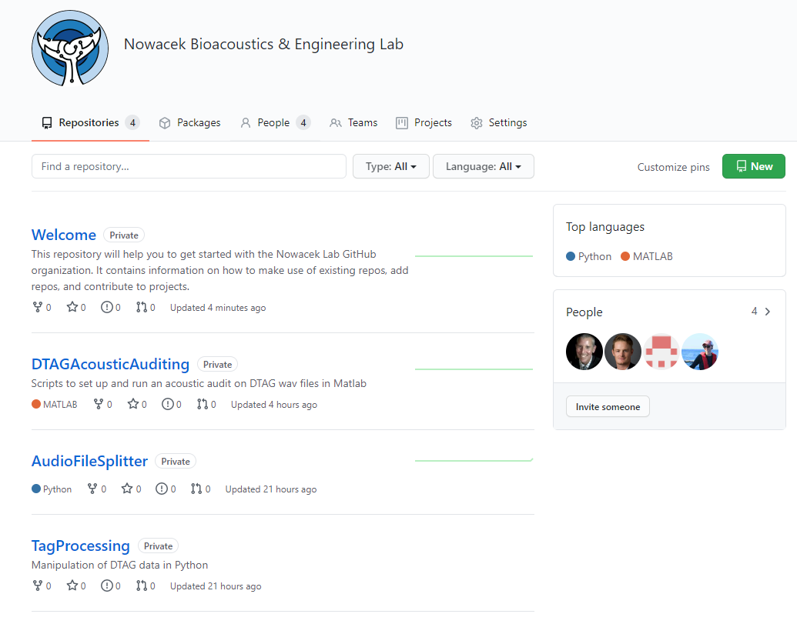

# Welcome
This repository will help you to get started with the Nowacek Lab GitHub organization. It contains information on how to make use of existing repos, add repos, and contribute to projects.

The purpose of having this GitHub organization is to 1) share finished code/toolboxes between people in the lab and 2) work on analyses for proejcts that are collaboartions between lab members. Individual projects that are unfinishedare best kept on your personal GitHub.

### What is a repository? (adapted from the GitHub documentation)
Right now, we’re in a GitHub repository within the Nowacek Lab organization called "Welcome". A repository is like a folder or storage space for your project. If you go to the [home page of this organization](https://github.com/NowacekLab), you can see what other repo's exist in this organization which look at lot more like a typical repo. Your project's repository contains all its files such as code, documentation, images, and more. It also tracks every change that you—or your collaborators—make to each file, so you can always go back to previous versions of your project if you make any mistakes.

You can own repositories individually (on your own GitHub account), or you can share ownership of repositories with other people in an organization (like the Nowacek Lab). 

You can restrict who has access to a repository by making a repository public or private. You'll have this option when you first make a repository and can change it at any time in the settings tab. 

---

### How do I get set up?
1. Make a GitHub account. If you are viewing this you probably already have one. 

2. Download the [GitHub Desktop](https://desktop.github.com/) app. This GUI will let you interact with GitHub from the desktop and will allow you to push/pull changes that you may make both locally and in your repo on the GitHub website without needing to use the terminal. 

3. Open GitHub Desktop and follow directions to connect to your GitHub account.

---

### I want to use code/a toolbox that exists in the Nowacek Lab GitHub organization... how do I get copies of the files?

1. Go to the [home page](https://github.com/NowacekLab) and click on the name of the repo where the code exists that you want to use. 

2. On the right you should see a green button that says "Code." Click on this button and in the drop down select "Open with GitHub Desktop."

3. Your browser may prompot you to open GitHub Desktop, if so click "Open GitHub Desktop"

4. This should take you into GitHub Desktop where you'll be asked to define the Local Path (**don't change the Repository URL**). **The Local Path is where the files will be stored locally (aka on your computer) just like any other file that you may create in some directory on your computer.** It's totally up to you and will probably depend on how you choose to organize your files.

5. Click clone!

6. Now you have the files from the GitHub repo locally (you can check the Local Path you gave GitHub Desktop to make sure) and can use them like any other file. You will also see the repository appear in your GitHub Desktop and should see that everything is up to date.  

7. If you eventually will want to push changes that you make to these files back to git and GitHub for use by other lab members later, you will want to start your own branch to save your changes. Think of a `master` as the main tree trunck and then a "branch" as a literal branch to that trunk. It's basically where iterations of the main scripts are stored. To make a new branch in GitHub Desktop find the "Current Branch" drop down and type in the name you want to give your new branch and then create it.

8. Now that you are in your new branch, you want to publish this to GitHub so go ahead and click "Publish branch."

9. You'll (hopefully) work with the files and end up making changes. As you make changes, these changes will appear in the GitHub Desktop. You'll see green text where you've added text, red text where you've removed text, and new files you add will appear on the left with different colored symbols. Give a brief commit message describing the changes you've made next to your profile image in the bottom left, then click "Commit to *whatever you named your branch*."

10. After you've commited these changes you need to "push" them to GitHub by clicking the blue "Push origin" button in the middle of the page.

11. Done! Go to the GitHub website and see your new branch. There's no need to do the "Compare pull request," that's only if you want your changes to replace what's happening in the master branch but we'll usually want to keep them separate. 

---

### Have completed code/a toolbox that I want to add to the Nowacek Lab GitHub organization... how do I add my files?

Create a new repo, 
Publish it to the Nowacek Lab GitHub organization,
If you fix bugs in the future commit those changes!

---

### I want to actively work on code/a toolbox with another lab member and want to store our work on the Nowacek Lab GitHub organization... how do I add my files/edit them?

---

### More information about GitHub

#### README files
Every repository should have a README file to tell other people why your project is useful, what they can do with your project, and how they can use it. README.md files are typically written in Markdown which is what the ".md" stands for. Your README file will be the first thing a person sees when they look at your repo.README files typically include information on:

* What the project does
* Why the project is useful
* How users can get started with the project
* Where users can get help with your project
* Who maintains and contributes to the project

There's a bunch of info out there about how to make a good README but [here's one place to start](https://www.makeareadme.com/). [Here's a good cheat sheet for Markdown](https://commonmark.org/help/) so you can make nice looking README's.

#### Editing repos
When you make any change to any file in your project (and save it), you’re making a commit. If you fix a typo, update a filename, or edit your code, you can add it to GitHub as a commit. Your commits represent your project’s entire history—and they’re all saved in your project’s repository.

With each commit, you have the opportunity to write a commit message (**do it!**), a short, meaningful (**the more descriptive the better!**) comment describing the change you’re making to a file. So you always know exactly what changed, no matter when you return to a commit. For the most part when you make a commit you'll want to commit to the `master` branch. The alternative is to "Create a **new branch** for this commit and start a pull request," which you'll only want to use when you make changes on your own 'branch' of the repo and bascially want to offer those changes to the `master` branch to consider which they can later choose to accept or not.

